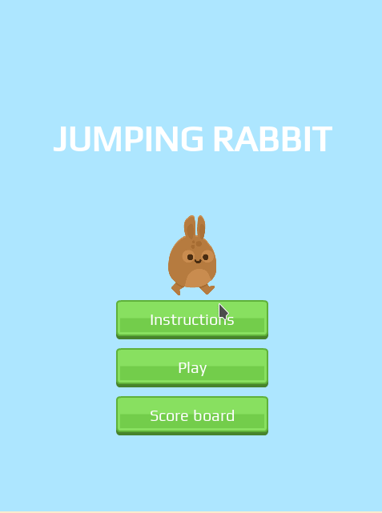

<!-- PROJECT SHIELDS -->
<!--
*** "reference style" links are used for readability.
*** Reference links are enclosed in brackets [ ] instead of parentheses ( ).
*** See the bottom of this document for the declaration of the reference variables
*** for contributors-url, forks-url, etc. This is an optional, concise syntax you may use.
*** https://www.markdownguide.org/basic-syntax/#reference-style-links
-->

[![Contributors][contributors-shield]][contributors-url]
[![Forks][forks-shield]][forks-url]
[![Stargazers][stars-shield]][stars-url]
[![Issues-open][issues-open-shield]][issues-open-url]
[![Issues-closed][issues-closed-shield]][issues-closed-url]

# phaser-game

> Game webapp using Phaser 3

</br>
<div align="center">
    
    <a href="http://phaser-game.surge.sh/"><h1 width="90">JUMPING RABBIT</h1></a>
</div>

# Table of Contents

- [About the game](#about-the-game)
- [How to play](#how-to-play)
- [Getting Started](#getting-started)
  - [Prerequisites](#prerequisites)
  - [Setup](#setup)
  - [Available scripts](#available-scripts)
- [Live Demo](#live-demo)
- [Built With](#built-with)
- [Tests](#tests)
- [Authors](#authors)
- [Contributing](#contributing)
- [Show your support](#show-your-support)
- [Acknowledgments](#acknowledgments)
- [License](#license)

# About the game

This is my Capstone project for Microverse's JavaScript course. In this project, the goal was to build a shooter game using JavaScript with the Phaser 3 framework and Webpack.

# How to play

- Hit the Instructions button for an in-game description
- Hit the Play button to start the game.
- Use the left, up and right arrow keys to move the Rabbit up.
- If you fall from the platform game is over
- Optional: submit your score to the score board.

# Getting Started

> To get a local copy up and running follow these simple example steps:

## Prerequisites

- `npm`
- `git`

## Setup

To install the game locally

- Download or clone the [game repository](https://github.com/fabricio-garcia/phaser-game).
- Navigate to the game root directory from your terminal.
- Install the required packages with the following command:

```javascript
npm i
```

- Start the game in your browser by typing:

```javascript
npm run start
```

## Available scripts

- `npm run start`: Runs the app in the development mode.

- `npm run build`: Builds the game for production to the build folder.

# Live Demo

[Play Jumping Rabbit](https://phaser-game.surge.sh)

# Built With

- [Phaser 3](https://phaser.io/phaser3)
- [JavaScript](https://developer.mozilla.org/en-US/docs/Web/JavaScript)
- [Babel](https://babeljs.io/)
- [WebPack](https://webpack.js.org/)
- [Jest](https://jestjs.io/)
- [VS Code](https://code.visualstudio.com/)
- [Kubuntu](https://kubuntu.org/)

# Tests

- Run `npm run test` in your terminal (check that you are in the repo's folder) to run unit tests for the logic components.

# Authors

👤 **Fabricio Garcia**

- Github: [@fabricio-garcia](https://github.com/fabricio-garcia)
- Twitter: [@this_fab](https://twitter.com/this_fab)
- Linkedin: [@fabricio-garcia](https://linkedin.com/fabricio-garcia)

# Contributing

Contributions, issues and feature requests are welcome! 🤝

Feel free to check the [issues page](issues/).

# Show your support

Give a ⭐️ if you like this project!

# Acknowledgments

- [Ourcade](https://ourcade.co/) for the [Infinite Jumper in Phaser 3](https://ourcade.co/books/infinite-jumper-phaser3/) tutorial.
- [Kenney](https://kenney.nl/)'s [jumper pack](https://kenney.nl/assets/jumper-pack) and [interface sounds](https://kenney.nl/assets/interface-sounds).

# License

This project is [MIT 📝](https://opensource.org/licenses/MIT) licensed.

<!-- MARKDOWN LINKS & IMAGES -->
<!-- https://www.markdownguide.org/basic-syntax/#reference-style-links -->

[contributors-shield]: https://img.shields.io/github/contributors/fabricio-garcia/phaser-game?style=plastic
[contributors-url]: https://github.com/fabricio-garcia/phaser-game/graphs/contributors
[forks-shield]: https://img.shields.io/github/forks/fabricio-garcia/phaser-game?style=plastic
[forks-url]: https://github.com/fabricio-garcia/phaser-game/network/members
[stars-shield]: https://img.shields.io/github/stars/fabricio-garcia/phaser-game?style=plastic
[stars-url]: https://github.com/fabricio-garcia/phaser-game/stargazers
[issues-open-shield]: https://img.shields.io/github/issues/fabricio-garcia/phaser-game?style=plastic
[issues-closed-url]: https://github.com/fabricio-garcia/phaser-game/issues
[issues-closed-shield]: https://img.shields.io/github/issues-closed/fabricio-garcia/phaser-game?style=plastic
[issues-open-url]: https://github.com/fabricio-garcia/phaser-game/issues
